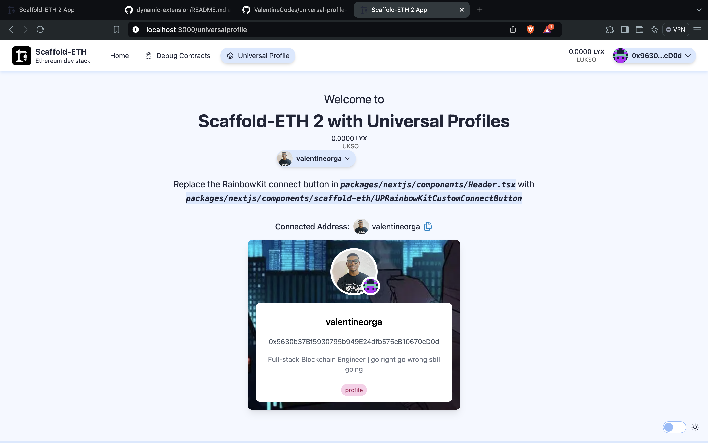

# Universal Profile Extension



This Scaffold-ETH extension introduces tools to facilitate the integration of Lukso's Universal Profiles.

[Watch Video](https://youtu.be/ifinfGaAc8Y)

## Features
- `useProfile` - A hook to query profile data
- `UniversalProfile` - A card component to display user's profile data
- `UPRainbowKitCustomConnectButton` - A connect button to display user's profile name and image
- `UniversalProviderAddress` - A component to display a connected user's profile name and image

## Setup Instructions

1. Create a new project with Universal Profile extension:

```bash
npx create-eth@latest -e ValentineCodes/universal-profile-extension
```

2. Add `images` to `packages/nextjs/next.config.js`

```javascript
...
const nextConfig = {
  images: {
    /** Allow images from all domains
     *  @next/image
     */
    remotePatterns: [
      {
        protocol: "https",
        hostname: "**", // Wildcard for all hostnames
        pathname: "**", // Wildcard for all paths
      },
    ],
  },
...
  ```

## Documentation

For more detailed information and usage visit the [Lukso Documentation](https://docs.lukso.tech/)
